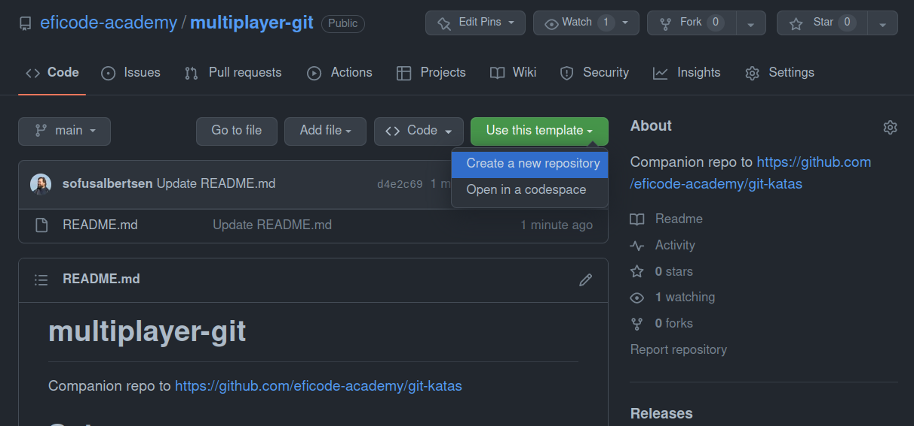
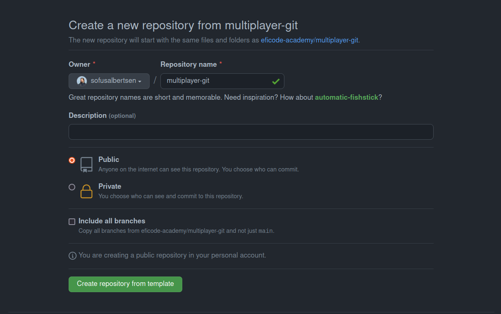
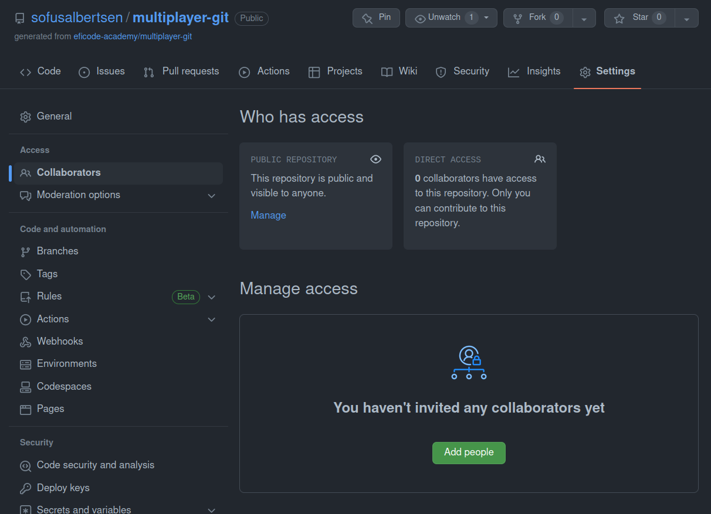

# Getting started

* Break out into groups of 3-4 (or whatever the instructor suggests)
* Elect a team leader in each group
* Choose a team name

Your team leader now has some special responsibilities below, and when those tasks are done, you will find instructions for everyone [further down this page](#everyone).

## Leader

The leader has the following responsibilities to get everyone started:

1. Create a team repo by using this GitHub repository as the template

1. Name the repository `<team-name>-multiplayer-git`

1. Invite team as collaborators to the newly created repo.

   * Go to Settings -> Collaborators

    

   * Add each of your team members as collaborator. This will send them an invite (by email unless they have changed their GitHub defaults), to join this new project.

    

   * The instructor might also request that you add their user as a collaborator as well, e.g. to be able to show progress on the big screen. 

## Everyone

Clone your team repository:

One you have accepted the invite, you will land on the GitHub page for your teams copy of the multiplayer project, with full read/write permissions. Clone the repository.

Note: It is possible to clone via either `https` or `ssh`, and each requires a different way of authenticating.

* [Howto SSH Auth](Howto_SSH_Auth.md)
* [Howto PAT Auth](Howto_PAT_Auth.md)

If you are doing this exercise in an instructor-led course, be sure to follow the provided instructions. Otherwise, go with your own personal preferences.
